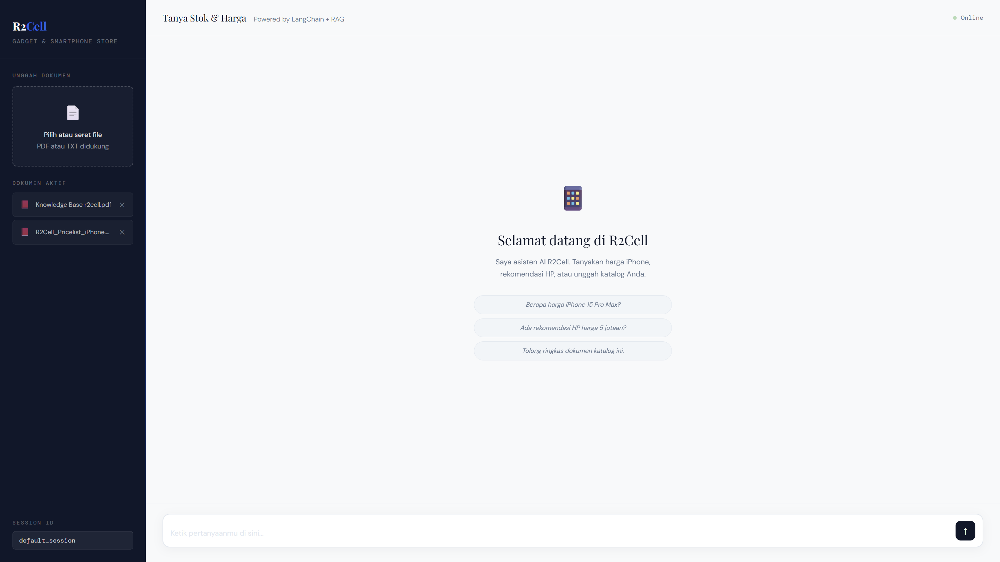

# 📱 R2Cell AI Agent - Asisten Cerdas Jual-Beli HP Bekas



Proyek ini adalah **AI Agent Customer Service** canggih untuk toko **R2Cell** (spesialis HP bekas). Dibangun dengan arsitektur modern yang menggabungkan kecerdasan buatan, basis data pengetahuan (RAG), dan pengawasan manusia secara *real-time*.

---

## 🌟 Fitur Unggulan

### 1. 🧠 Smart RAG (Retrieval-Augmented Generation)
AI dapat menjawab pertanyaan pelanggan berdasarkan dokumen internal seperti:
- Katalog stok barang terbaru.
- Daftar harga unit (iPhone, Samsung, dll).
- Kebijakan garansi dan layanan purna jual.

### 2. 💾 Persistent AI State (PostgreSQL)
Dilengkapi dengan sistem **Checkpointing** menggunakan PostgreSQL. Agent ini memiliki "ingatan" jangka panjang:
- Riwayat percakapan tidak hilang saat server restart.
- Mendukung multi-sesi percakapan berbasis `thread_id`.
- Melanjutkan konteks diskusi kapan saja.

### 3. 🤝 Human-In-The-Loop (HITL) - Admin Interrupt
Fitur tercanggih di mana AI tidak berjalan sendiri secara membabi buta. Jika pelanggan menanyakan **DISKON**, AI akan secara otomatis:
- Melakukan interupsi (*interrupt*) ke status "Menunggu".
- Meminta persetujuan admin secara manual lewat sistem.
- Melanjutkan percakapan (*resume*) hanya setelah admin memberikan instruksi harga.

### 4. 🎨 Modern & Responsive UI
Antarmuka Chat yang intuitif dengan dukungan:
- Pengunggahan dokumen (PDF/TXT) langsung dari browser.
- Indikator status agen (lagi mikir, lagi nanya admin, dsb).
- Notifikasi interaksi admin secara real-time.

---

## 🛠️ Stack Teknologi

- **Backend Framework**: [FastAPI](https://fastapi.tiangolo.com/) (Python)
- **AI Orchestration**: [LangGraph](https://langchain-ai.github.io/langgraph/) & [LangChain](https://www.langchain.com/)
- **Vector Database**: [ChromaDB](https://www.trychroma.com/)
- **State Persistence**: [PostgreSQL](https://www.postgresql.org/) (PostgresSaver)
- **LLM Engine**: OpenRouter (Model fleksibel)
- **Embedding**: Local Ollama (Gemma) / OpenAI Embeddings

---

## 📂 Struktur Proyek

```bash
.
├── agents/             # Definisi Agent, Prompts, dan Factory
├── core/               # Konfigurasi Database (Postgres & Chroma)
├── tools/              # Custom Tools (Cari Dokumen, Tanya Admin)
├── documents/          # Penyimpanan fisik file yang diunggah
├── chroma_data/        # Folder persistensi vektor
├── main.py             # Server FastAPI & API Endpoints
├── index.html          # Frontend Modern (Single Page)
└── requirements.txt    # Dependensi aplikasi
```

---

## 🚀 Alur Kerja & Contoh Penggunaan

### Contoh Skenario: Penawaran Harga
1. **User**: *"Berapa harga iPhone 13 bekas yang mulus?"*
2. **AI**: (Mencari di dokumen katalog) -> *"Harganya Rp 9.500.000 Kak."*
3. **User**: *"Bisa kurang gak jadi 9 juta?"*
4. **AI**: (Menjalankan Tool `tanya_admin_diskon`) -> Menampilkan status *"Menunggu persetujuan admin..."* di UI.
5. **Admin**: Memberikan balasan pada sistem: *"Kasih 9,2 juta bonus casing."*
6. **AI**: (Melanjutkan otomatis) -> *"Oke Kak, kata admin kalau 9 juta belum bisa, tapi boleh di harga 9,2 juta dan nanti saya kasih bonus casing gratis! Mau?"*

---

## 💼 Use Cases (Kasus Penggunaan)

- **Automasi Layanan Pelanggan**: Mengurangi beban admin menjawab pertanyaan berulang.
- **Asisten Sales Real-time**: Membantu sales mencari spesifikasi unit dengan cepat.
- **Sistem Negosiasi Terkontrol**: Memastikan AI tidak memberikan diskon sembarangan tanpa izin pemilik toko.

---

## ⚙️ Cara Menjalankan

1. **Instalasi Dependensi**:
   ```bash
   pip install -r requirements.txt
   ```

2. **Konfigurasi Database**:
   Pastikan PostgreSQL Anda berjalan dan buat database bernama `r2cell_ai`. Atur URI di `core/config.py`.

3. **Jalankan Server**:
   ```bash
   uvicorn main:app --reload
   ```

4. **Akses UI**:
   Buka `http://127.0.0.1:8000` di browser Anda.

---

## 📄 Lisensi
Sistem ini dikembangkan secara eksklusif untuk operasional cerdas R2Cell.

